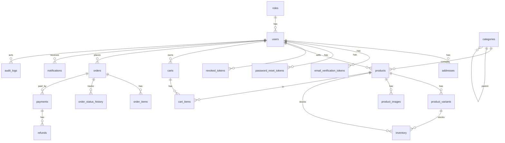

# ER Diagram — M1 (22 tables, criterion: ≥12 via migrations)

Tables: `roles, users, addresses, email_verification_tokens, password_reset_tokens,
revoked_tokens, categories, products, product_variants, product_images, inventory,
carts, cart_items, orders, order_items, order_status_history, payments, refunds,
discount_codes, notifications, audit_logs, ml_predictions` (22).

Key constraints: `users.email UNIQUE`, `products.sku UNIQUE`, `orders.order_number UNIQUE`,
`orders.idempotency_key UNIQUE`, `payments.gateway_ref UNIQUE`, `payments.webhook_event_id UNIQUE`.
Prod adds Postgres `tsvector + GIN` on products (M2 search).
